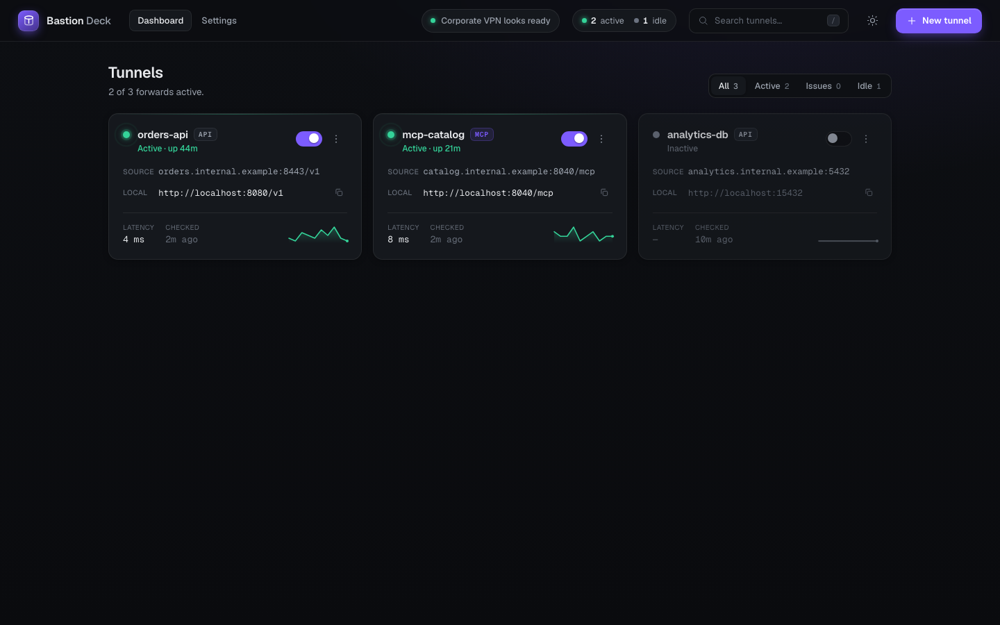

# BastionDeck



BastionDeck is a local web panel for bringing private-network services to your laptop through SSH bastion hosts.

If your company keeps databases, APIs, dashboards, MCP servers, or other internal tools behind a VPN and a jump server, BastionDeck gives you a small UI for turning those private `host:port` endpoints into stable `localhost` URLs.

It is built around the standard OpenSSH local-forwarding flow:

```bash
ssh -N -L <local-port>:<private-host>:<private-port> <user>@<bastion-host>
```

BastionDeck does not replace your VPN, SSH keys, or access policies. It makes the tunnel setup, status checks, restart flow, and local URL copying less manual.

## Use Cases

- Access an internal API from local scripts, IDEs, or browser tools.
- Connect desktop clients to private databases through a bastion host.
- Expose MCP or JSON-RPC services from a corporate network to localhost.
- Keep multiple SSH local forwards visible, named, checked, and restartable.
- Share a lightweight tunnel workflow with teammates without sharing credentials.

## Features

- Create tunnels from `host:port`, `host:port/path`, or full internal URLs.
- Configure one global bastion/jump host for all tunnels.
- Configure SSH login and key handling once in Settings.
- Agent-ready local API for creating tunnels, changing settings, checking status, and reading logs.
- VPN preflight: DNS check plus TCP check to the selected jump host on port `22`.
- SSH public-key auth only. Password prompts are disabled with `BatchMode=yes`.
- Health checks every 5/10/30/60 seconds.
- MCP probe support through JSON-RPC `initialize`.
- Local persistent settings in the user's home directory, outside the installed app.
- Cross-platform install flow for Homebrew and Windows `cmd.exe`.

## Requirements

- Node.js 22+
- OpenSSH client available as `ssh`
- Network access to your private environment, usually through a corporate VPN
- SSH public-key access to the selected jump host

## Install

macOS with Homebrew:

```bash
brew tap DimaUsenko/tap
brew install bastiondeck
bastiondeck
```

Windows from `cmd.exe`:

```cmd
curl.exe -L -o install.cmd https://github.com/DimaUsenko/bastiondeck/releases/latest/download/install.cmd
install.cmd
```

Then open a new `cmd.exe` window:

```cmd
bastiondeck
```

Run from source:

```bash
git clone https://github.com/DimaUsenko/bastiondeck.git
cd bastiondeck
npm ci
npm run build
bastiondeck
```

## Development

```bash
npm ci
npm run dev
```

Open:

```text
http://localhost:5173
```

Production build:

```bash
npm run build
npm run start:cli
```

Checks:

```bash
npm run typecheck
npm run build
npm test
npm audit --omit=dev
```

## Runtime Options

The installed command is:

```bash
bastiondeck
```

Options:

```bash
bastiondeck --host 127.0.0.1 --port 8787
bastiondeck --url-host bastiondeck.local
bastiondeck --data-dir ~/.bastiondeck-team
bastiondeck --no-open
```

Environment variables:

```bash
BD_HOST=127.0.0.1
BD_PORT=8787
BD_PUBLIC_HOST=bastiondeck.local
BD_APP_URL=http://bastiondeck.local:8787
BD_DATA_DIR=~/.bastiondeck
```

`--url-host` changes the URL that is printed/opened. The hostname must still resolve to the machine. For a friendly local name like `bastiondeck.local`, configure DNS or a hosts-file entry to point it at `127.0.0.1`.

Use `--host 0.0.0.0` only when you intentionally want the UI reachable from other machines on the network.

## Agent-Ready API

BastionDeck exposes a local JSON API so coding agents and scripts can operate the same tunnel workflow as the UI: configure the global jump host and SSH login, create or edit tunnels, start/stop/restart them, inspect health, and read recent logs.

The one-shot agent snapshot is:

```bash
curl -s http://127.0.0.1:8787/api/status
```

Agents can install or reference the bundled skill at [bastiondeck_skill/SKILL.md](bastiondeck_skill/SKILL.md). The skill documents the API workflow and safe operating boundaries for creating tunnels to private services through BastionDeck.

Common endpoints:

- `GET /api/status` - settings, tunnel runtime status, and preflight in one response.
- `PUT /api/settings` - save global jump host, SSH login, key path, port range, and health interval.
- `POST /api/tunnels` - create a tunnel from target host/port/path and local port.
- `POST /api/tunnels/:id/start|stop|restart` - control tunnel lifecycle.
- `GET /api/tunnels/:id/logs/snapshot` - read the current in-memory log buffer.

## Persistent Data

Settings and saved tunnels are stored outside the application:

- macOS/Linux: `~/.bastiondeck/state.json`
- Windows: `%USERPROFILE%\.bastiondeck\state.json`

Uninstalling or replacing the app does not remove this folder. Delete it manually only when you want a full reset.

## Homebrew Distribution

Install:

```bash
brew tap DimaUsenko/tap
brew install bastiondeck
bastiondeck
```

The tap formula is maintained from [packaging/homebrew/bastiondeck.rb](packaging/homebrew/bastiondeck.rb).

## Windows CMD Install

The release workflow publishes `bastiondeck-windows.zip` and `install.cmd`.

Users can install from `cmd.exe`:

```cmd
curl.exe -L -o install.cmd https://github.com/DimaUsenko/bastiondeck/releases/latest/download/install.cmd
install.cmd
```

Then open a new `cmd.exe` window:

```cmd
bastiondeck
```

Uninstall app files:

```cmd
curl.exe -L -o uninstall.cmd https://github.com/DimaUsenko/bastiondeck/releases/latest/download/uninstall.cmd
uninstall.cmd
```

Saved settings remain in `%USERPROFILE%\.bastiondeck`.

## Release Flow

CI is defined in [.github/workflows/ci.yml](.github/workflows/ci.yml).

Tag release:

```bash
git tag v0.1.0
git push origin v0.1.0
```

The release workflow builds and uploads:

- `bastiondeck-source.tar.gz`
- `bastiondeck-windows.zip`
- `install.cmd`
- `uninstall.cmd`

After each release, update the Homebrew tap formula checksum for the new tag.
